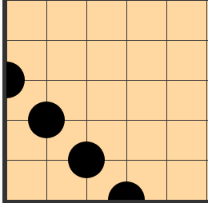
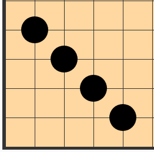

# 五子棋程序中对判断四连的函数的解释

此处以horizontal情形为例，其他情形类似

## 1. count = 4

count = 4说明四个黑色棋子已经连成了一条线，我们现在分情况来讨论

### 1.1 left side

|黑黑黑黑__ __	此时p1 = -1

p1             p2 

要想成四那么**p2**处必须是空，**p2 + 1**处必不能是黑色棋子(会形成长连)

### 1.2 right side

是 **1.1**的对称情形，不再赘述

### 1.3 near left side

|空黑黑黑黑__ __	此时p1=1

  p1              p2

成四有以下三种情况：

* p1为白，p2为空，p2+1不为黑
* p1为空，p2为白
* p1, p2都为空

### 1.4 near right side

是**1.3**的对称情形，不再赘述

### 1.5 center

__ __ 黑黑黑黑__ __ 

   p1                 p2 

不成四的有四种情况：

* p1, p2同时为白色
* p1-1, p2+1同时为黑色
* p1为白色，p2+1为黑色
* p1为黑色，p2+1为白色

## 2. count = 3

count = 3说明已经有三个棋子连在了一条线上

此处仍然以horizontal情形为例：

**黑空黑黑黑**	or	**黑黑黑空黑**

以上两种情况是成四的基本单元

这两种基本单元的左右两侧都不能为黑色棋子，否则会形成长连

但其实我们在计数的时候，已经能够确定：

情形1的右侧一定不为黑色棋子，情形2的左侧也一定不为黑色棋子

所以我们只需要关心情形1左侧的情况 和 情形2右侧的情况即可

## 3. count = 1

count = 1 说明这个棋子的落单了

我们需要检查棋子的左右两侧是否构成基本单元

​    **黑空黑黑黑**	or	**黑黑黑空黑**

p1   p2 								 p1    p2

对于情形1	p1不得为黑色棋子，p2为空，p2+1, p2+2, p3+3为黑色棋子，p3+4不得为黑色棋子

对于情形2	p2不得为黑色棋子，p1为空，p1-1, p1-2, p1-3为黑色棋子，p1-4不得为黑色棋子

## 4. count = 2

**黑黑空黑黑**为基本单元

只需要检测是否形成基本单元 并检查基本单元两侧是否有黑色棋子即可(有黑色棋子会形成长连)

## 5. 附注

当四连呈对角线排列时，会出现以下几种特殊情况：

**special case I**

**special case II**

在横向和纵向考虑的时候，当四连的一段在棋盘的一侧时，另一侧肯定不会在棋盘的另一侧

但是考虑对角线的情形时，当四连的一段在棋盘的一侧时，另一侧可能会在棋盘的另一侧
