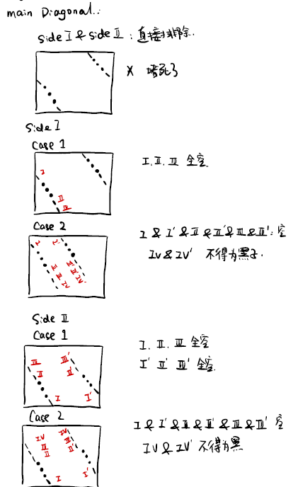
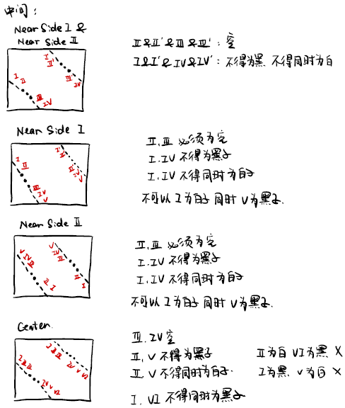
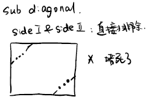
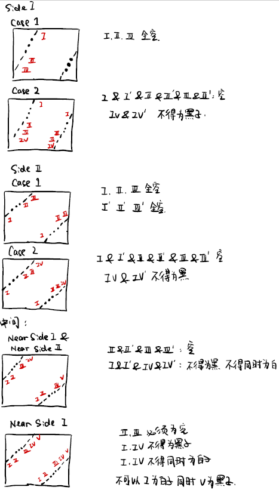
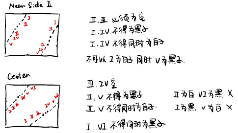
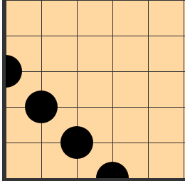
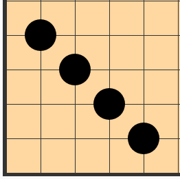
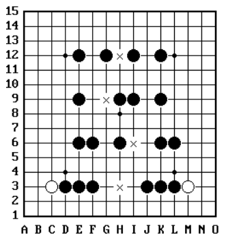

# 禁手部分

禁手部分的内容主要在文件`include/check_forbidden_moves.h`与`src/check_forbidden_moves.c`中。

`include/check_forbidden_moves.h`中存储函数的声明，`src/check_forbidden_moves.c`中存储函数定义。

## 1. 基本结构

文件：`src/check_forbidden_moves.c`

### 1.1 组件I: 记录指定棋子周围相同棋子的数目

简单来说，就是数数指定棋子周围横竖斜分别有多少个与指定棋子连在一起的且相同的棋子。

```c
static int count_horizontally(int x, int y, int * p1, int * p2, int type);
static int count_vertically(int x, int y, int * p1, int * p2, int type);
static int count_main_diagonally(int x, int y, int * p1, int * p2, int * p3, int * p4, int type);
static int count_sub_diagonally(int x, int y, int *p1, int * p2, int * p3, int * p4, int type)
```

### 1.2 组件II: 判断指定棋子周围是否形成活三

```c
int is_active_three_horizontal(int x, int y);
int is_active_three_vertical(int x, int y);
int is_active_three_main_diagonal(int x, int y);
int is_active_three_sub_diagonal(int x, int y);
```

### 1.3 组件III: 判断指定棋子周围是否形成四

```c
int is_four_horizontal(int x, int y);
int is_four_vertical(int x, int y);
int is_four_main_diagonal(int x, int y);
int is_four_sub_diagonal(int x, int y);
```

### 1.4 组件IV: 判断是否形成五连

```c
int is_five_black(int x, int y);
int is_five_white(int x, int y);
```

### 1.5 组件V: 判断是否形成长连禁手

```c
int is_over_line(int x, int y)
```

### 1.6 组件VI: 判断是否形成三三禁手

```c
int is_over_one_active_three(int x, int y);
```

### 1.7 组件VII: 判断是否形成四四禁手

```c
int is_over_one_four(int x, int y);
```

### 1.8 组件VIII: 判断是否形成禁手

```c
int is_forbidden_move(int x, int y);
```

## 2. 主体部分I: 活三的判定

此处黑棋子用`B`表示，白棋子用`W`表示，空位用`__`表示，边界用`|`表示

### 2.1 连活三(count = 3)

#### 2.1.1 horizontal

**SIDE:  p1 == 0 || p2 == SIZE - 1: **

|__ B B B __ __ __  	p1, p2, p2 + 1处必须为空，p2+2处不得为黑色
  p1		  p2 

__ __ __ B B B __|	  p1, p2, p1 - 1处必须为空，p1 - 2处不得为黑色
	      p1         p2

**NEAR SIDE:   p1 == 1 || p2 == SIZE - 2**

|__ __ B B B __ __ __ 	p1, p2处必须为空，p1 - 1, p2 + 1处不得为黑，p1 - 1, p2 + 1不得同时为白
       p1          p2			不可以p1 - 1为白同时p2 + 2为黑

__ __ __ B B B __ __|	 p1, p2处必须为空，p1 - 1, p2 + 1处不得为黑，p1 - 1, p2 + 1不得同时为白
         p1          p2			不可以p1 - 2为白同时p2 + 1为黑

**CENTER: p1 > 1 || p2 < SIZE - 2**

__ __ __ B B B __ __ __ 	p1, p2必须同时为空，p1 - 1, p2 + 1不得为黑，p1 - 1, p2 + 1不得同时为白
         p1          p2			 p1 - 2, p2 + 2不得同时为黑
										 不得p1 - 2为黑同时p2 + 1为白, 不得p1 - 1为白同时p2 + 2为黑

#### 2.1.2 vertical

与2.1.1情形对称，判断方式完全一致

#### 2.1.3 main diagonal





#### 2.1.4 sub diagonal







### 2.2 跳活三

#### 2.2.1 count = 2

**空黑黑空黑空** || **空黑空黑黑空**(无论是horizontal还是vertical还是diagonal)

<font color="red">p1</font>       <font color="red">p2</font>                     <font color="red">p1</font>       <font color="red">p2</font>    

这是**count=2**情形最重要的**基本单元**，如果该基本单元不存在，那么必然不可能形成活三


此处以horizontal为例，vertical & diagonal类似

**棋盘左端**

**|**空黑黑空黑空	or	**|**空黑空黑黑空

* 在基本单元右端再放置一个黑色棋子的话，会形成四，故这种操作是被禁止的

* 在基本单元右端再放置一个白色棋子的话，可以验证，这仍然是活三

* 基本单元右端空着的话也仍然是活三

**棋盘右端**

空黑黑空黑空**|**	or	**|**空黑空黑黑空

* 在基本单元左端再放置一个黑色棋子的话，会形成四，故这种操作是被禁止的

* 在基本单元左端再放置一个白色棋子的话，可以验证，这仍然是活三

* 基本单元左端空着的话也仍然是活三

**棋盘中间**

空黑黑空黑空	or	空黑空黑黑空

对于在中间的情形(针对第一种情形，第二种情形类似)，如果

* 1.左边放置黑色棋子: 	形成四	这种操作是被禁止的

* 2.右边放置黑色棋子:	

  如果此时白棋让黑棋一手，那么黑棋有三种位置可以选择

  - 下在最左边的空里面 那么白棋只要下在中间的空中，那么黑棋就不能形成五连
  - 下在中间的空里面 那么白棋只要放在最左边的空中，那么黑棋要是再下到最右边的空中，形成长连禁手
  - 下在最右边的空里面 无意义

- 3.左右都放置黑色棋子 显然不能构成活三

通过上面的分析，我们能够得出，在棋盘中间的时候，基本单元左右两侧都不能有黑棋子

不难得出，基本单元左右两侧是白棋子或者空都构成活三

#### 2.2.2 count = 1

与count = 2情形大同小异，不再赘述

##3. 主体部分II: 四的判定

此处以horizontal情形为例，其他情形类似

### 3.1 count = 4

count = 4说明四个黑色棋子已经连成了一条线，我们现在分情况来讨论

#### 3.1.1 left side

|黑黑黑黑__ __	此时<font color="red">p1</font> = -1

<font color="red">p1</font>             <font color="red">p2</font> 

要想成四那么**p2**处必须是空，**p2 + 1**处必不能是黑色棋子(会形成长连)

#### 3.1.2 right side

是 **1.1**的对称情形，不再赘述

#### 3.1.3 near left side

|空黑黑黑黑__ __	此时<font color="red">p1</font>=1

  <font color="red">p1</font>              <font color= "red">p2</font>

成四有以下三种情况：

* p1为白，p2为空，p2+1不为黑
* p1为空，p2为白
* p1, p2都为空

#### 3.1.4 near right side

是**1.3**的对称情形，不再赘述

#### 3.1.5 center

__ __ 黑黑黑黑__ __ 

   <font color="red">p1</font>                 <font color="red">p2</font> 

不成四的有四种情况：

* p1, p2同时为白色
* p1-1, p2+1同时为黑色
* p1为白色，p2+1为黑色
* p1为黑色，p2+1为白色

### 3.2 count = 3

count = 3说明已经有三个棋子连在了一条线上

此处仍然以horizontal情形为例：

**黑空黑黑黑**	or	**黑黑黑空黑**

以上两种情况是成四的基本单元

这两种基本单元的左右两侧都不能为黑色棋子，否则会形成长连

但其实我们在计数的时候，已经能够确定：

情形1的右侧一定不为黑色棋子，情形2的左侧也一定不为黑色棋子

所以我们只需要关心情形1左侧的情况 和 情形2右侧的情况即可

### 3.3 count = 1

count = 1 说明这个棋子的落单了

我们需要检查棋子的左右两侧是否构成基本单元

​    **黑空黑黑黑**	or	**黑黑黑空黑**

<font color="red">p1</font>   <font color = "red">p2</font> 								 <font color="red">p1</font>    <font color="red">p2</font>

对于情形1	p1不得为黑色棋子，p2为空，p2+1, p2+2, p3+3为黑色棋子，p3+4不得为黑色棋子

对于情形2	p2不得为黑色棋子，p1为空，p1-1, p1-2, p1-3为黑色棋子，p1-4不得为黑色棋子

### 3.4 count = 2

**黑黑空黑黑**为基本单元

只需要检测是否形成基本单元 并检查基本单元两侧是否有黑色棋子即可(有黑色棋子会形成长连)

### 3.5. 附注

当四连呈对角线排列时，会出现以下几种特殊情况：

**special case I**



**special case II**



在横向和纵向考虑的时候，当四连的一段在棋盘的一侧时，另一侧肯定不会在棋盘的另一侧

但是考虑对角线的情形时，当四连的一段在棋盘的一侧时，另一侧可能会在棋盘的另一侧

### 3.6 在一条线上形成两个四



