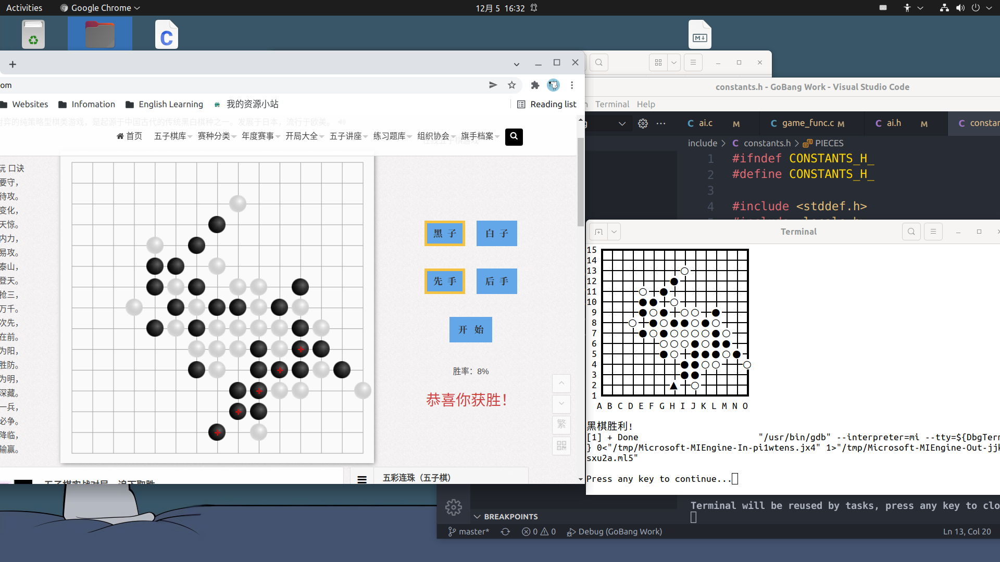

# 五子棋人机对战程序

程序的作者为中国科学院大学2020级本科生。此程序为C语言程序设计与实验的课程作业。

作者水平有限，如有未能解决的bug或者您有更好的改进方法，请联系`anwentao1@gmail.com`

## 1. 开发环境

本程序使用VSCode for Linux开发。

**开发环境**：`Ubuntu 21.04`

**编译环境**：`gcc 10.3.0`

**调试环境**：`gdb 10.1.90.20210411-git`

**如何编译本程序：**

将本程序克隆到`Ubuntu桌面版`，在文件路径打开终端，输入`make`即可开始编译。

如果你想使用VSCode对本程序进行二次开发，且你已经使用VSCode搭建好了C/C++开发环境，那么可以直接使用VSCode打开程序文件夹，按`F5`(或`Fn+F5`)即可开始调试。

## 2. 程序说明

此程序有两个模式：人人对战与人际对战模式。运行程序时，根据程序提示即可进行游戏。

本程序的输入输出为`UTF-8`编码。如果您发现在运行时程序乱码，大概率是因为您的终端的编码不是**UTF-8**。

## 3. 程序运行快照

